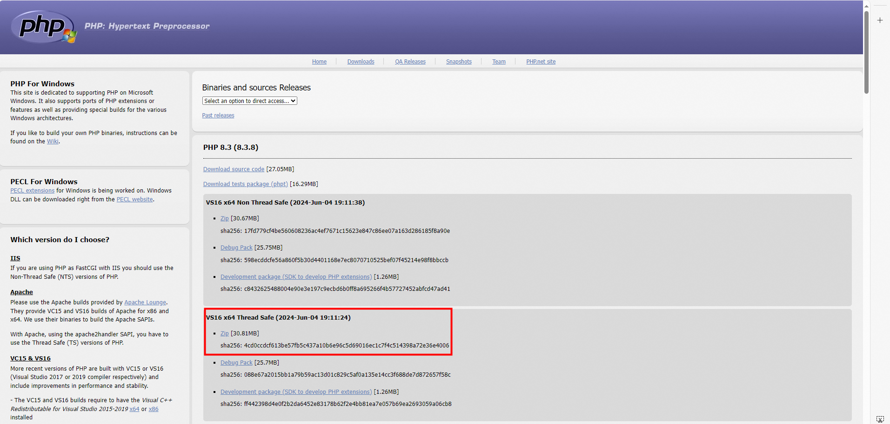

# 1 php 


访问[PHP for Windows](https://windows.php.net/download/)官网，下载x64 Thread Safe的ZIP安装包。




解压安装包，并配置环境变量。

验证是否安装成功：同时按下Win+R键输入cmd打开命令行，在命令行输入php -v，如果出现如下所示的信息，则表示安装成功。


---


BWS18067:  d:\SmallApp\php-8.4.7-nts-Win32-vs17-x64\

# 2 配置php.ini文件 


php.ini是PHP的配置文件，主要用于控制PHP解释器的行为和功能。
在解压文件夹中找到php.ini-development，它一般用于开发环境，将文件重命名为php.ini。

----

BWS18067: d:\SmallApp\php-8.4.7-nts-Win32-vs17-x64\php.ini  

只修改了 
```
; Directory in which the loadable extensions (modules) reside.
; https://php.net/extension-dir
;extension_dir = "./"
; On windows:
extension_dir = "ext"   # 这里的 我把 开始的 ; 给删除了 
```


# 3 Composer安装步骤


在任何机器上都还没有安装 


Composer是PHP社区广泛使用的一个依赖管理工具，包括依赖管理、版本控制、自动加载、项目初始化等功能。

下载Composer安装程序：访问[Composer](https://getcomposer.org/download/)官网，在Windows Installer中单击Composer-Setup.exe下载。


    
安装Composer：双击Composer-Setup.exe，根据安装向导完成安装。


验证是否安装成功：同时按下`Win+R键`输入`cmd`打开命令行，在命令行输入`composer -V`，如果出现如下所示提示，则表示安装成功。
    
```powershell
Composer version 2.7.7 2024-06-10 22:11:12
PHP version 7.4.33 (D:\ide\PHP\php.exe)
Run the "diagnose" command to get more detailed diagnostics output.
```

---

（可选）配置Composer镜像源：在中国内地，由于网络问题，可能需要配置Composer使用国内镜像源以加快下载速度。可以通过修改Composer的全局配置实现，例如使用清华的镜像：
    
```powershell
composer config -g repo.packagist composer https://mirrors.tuna.tsinghua.edu.cn/composer/
```

