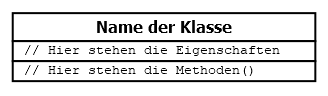

# 1 Klassen und Objekte

Eine Klasse ist ein Behälter zusammengehöriger Funktionen (Funktionen heißen nun **Methoden**) und Variablen (Variablen heißen nun **Eigenschaften**). Diesem Behälter geben wir einen Namen (den Klassennamen). Alles was zu einer Klasse gehört, wird mit diesen Klammern { ... } zusammengefasst.

Damit sieht der formale Aufbau einer einfachen Klasse wie folgt aus

```
class Klassenname
{
  // Eigenschaften 

  // Methoden()
}
```

Dies zeichnen wir in einem Klassendiagramm, damit wir wissen, zu welchem Klassennamen welche Eigenschaften und Methoden gehören. Wir zeichnen sozusagen den Inhalt des "Behälters".

Ein Klassendiagramm unterteilt sich immer in drei Bereiche. Im oberen Bereich steht der Klassenname. Im Bereich darunter stehen alle Eigenschaften und im unteren Bereich stehen alle Methoden.





## 1.1 **Beispiel einer einfachen Klasse**  

Beispiel

Im ersten Beispiel gibt es nur eine Methode _changePhoneNumber()_.

```
<?php declare(strict_types=1);
class Student
{
    public function changePhoneNumber(string $newPhoneNumber): void
    {
        echo "Die Telefonnummer lautet: $newPhoneNumber";
    }
}
```

  
Darstellung im Klassendiagramm  
[](https://isp.eduloop.de/mediawiki/images/isp.eduloop.de/7/77/Student1.png)

In diesem Beispiel haben wir die neuen Möglichkeiten einer Klasse noch nicht genutzt. Beispielsweise gibt es noch keine Eigenschaften der Klasse.

**Zeile 5 _public_**: Auf das _public_ gehen wir [später](https://isp.eduloop.de/loop/Sichtbarkeit "Sichtbarkeit") ein. Hier einfach mal so hinnehmen, dass wir dies vor _function_ so hinschreiben.

**Zeile 5 _string_**: Anders als bei Funktionen geben wir nun bei Methoden an, welchen Typ der Variablen (also _string_, _int_, etc.) an Methoden übergeben werden. Dass wir dies angeben müssen, wurde in **Zeile 1** mit `<?php declare(strict_types=1)`festgelegt. In unserem Beispiel muss aus dem Hauptprogramm der Inhalt der Variablen _$newPhoneNumber_ also ein _string_ sein.


**Zeile 5 _void_** bedeutet, dass keine Rückgabe an das Hauptprogramm erfolgt. In unserem Beispiel ist dies klar, denn mit Echo geben wir die Ausgabe direkt an den Browser.

## 1.2 **Beispiel einer einfachen Klasse**  
In diesem zweiten Beispiel wird die Telefonnummer in einer Eigenschaft gespeichert und ist später "fest im Objekt enthalten" und kann jederzeit abgerufen werden (solange das Programm läuft).

Im zweiten Beispiel gibt es eine Eigenschaft $phoneNumber und eine Methode changePhoneNumber(). 

```
<?php declare(strict_types=1);

class Student
{
    // Eigenschaften der Klasse festlegen  
    public $phoneNumber = "keine Angabe";

    // Methoden der Klasse festlegen
    public function changePhoneNumber(string $newPhoneNumber): void
    {
        $this->phoneNumber = $newPhoneNumber;
        echo "Die Telefonnummer lautet: $newPhoneNumber";
    }
}
```

Darstellung im einfachen Klassendiagramm  
[](https://isp.eduloop.de/mediawiki/images/isp.eduloop.de/d/d7/Student2.png)

Alternative Darstellung im ausführlichen Klassendiagramm  
[](https://isp.eduloop.de/mediawiki/images/isp.eduloop.de/a/a4/Student3.png)


Das Problem ist, dass Telefonnummern oft mit einer _0_ beginnen und es dann zu Überraschungen kommen kann ([siehe Umwandlung in Oktalzahlen](https://ispa.oncampus.de/loop/Integer)). Da mit Telefonnummern normalerweise keine mathematischen Berechnungen durchgeführt werden, kann man besser _String_ statt _Integer_ verwenden.  
  
Wichtig: alle Daten, die über ein Webformular an den PHP-Code geschickt werden, sind im Array $_REQUEST() enthalten und immer vom Typ _string_. Sie müssen die Variablen dann im Hauptprogramm konvertieren oder alternativ als _string_ weitergeben, sofern Sie mit den Variablen keine Berechnungen vornehmen möchten.


**Zeile 9:** Die Methode _changePhoneNumber()_ nimmt aus dem Hauptprogramm eine Telefonnummer entgegen und speichert diese in der Variablen`$newPhoneNumber`. Mit dieser Variablen _`$newPhoneNumber`_ kann innerhalb der Methode "gearbeitet" werden. Wie auch in Funktionen, gilt diese Variable _$newPhoneNumber_ nur innerhalb dieser Methode und nirgendwo anders.

**Zeile 6:** Jetzt haben wir aber eine Eigenschaft `$phoneNumber`_ in der Klasse eingeführt und wollen die neue Telefonnummer fest in der Klasse (oder genauer gesagt im Objekt) speichern. Dazu müssen wir die Variable `$newPhoneNumber` der Eigenschaft zuweisen. Dies erfolgt mit der Syntax  `$this->` (siehe **Zeile 11**).

Somit übertragen wir in **Zeile 11** die Telefonnummer der Variable`$newPhoneNumber` an die Eigenschaft `$phoneNumber`mit:  `$this->phoneNumber = $newPhoneNumber`;

Wichtig

Achtung: _`$newPhoneNumber`_ ist eine ganz normale Variable in einer Methode. _`$phoneNumber`_ hingegen ist eine Eigenschaft der Klasse. Diese Unterscheidung muss IHNEN ganz glasklar sein/werden.

## 1.3 Eigenschaften überschreiben

In der objektorientierten Programmierung spricht man oft vom _**überschreiben**_. Das Verständnis was damit gemeint ist, fällt Studierenden oft schwer. Dabei ist es ganz einfach.

Im Beispiel oben haben wir die Eigenschaft `$phoneNumber` in **Zeile 4** mit dem Wert _"keine Angabe"_ vorbelegt. Sobald das Hauptprogramm die Methode _`changePhoneNumber()`_ aufruft und eine Telefonnummer in _$newPhoneNumber_ übergeben bekommt, wird in **Zeile 9** der vorbelegte Wert _"keine Angabe"_ mit dem neuen Wert _überschrieben_.

  

## 1.4 **Klassen im Hauptprogramm "bekannt machen" = Objekte erzeugen**  

Nun wollen wir mit der Klasse im Hauptprogramm arbeiten. Früher konnten wir mit einer Funktion einfach arbeiten, indem wir die Funktion aufgerufen haben. Nun aber haben wir die Klasse als "Behälter" für viele Funktionen eingeführt (die wir nun Methoden nennen). Wir müssen somit den "Behälter" mit seinen Eigenschaften und Methoden dem Hauptprogramm bekannt machen.

Wir rufen die Klasse nicht einfach auf, sondern machen uns beim Aufruf "eine Art Kopie" der Klasse, so wie man ein "Schnittmuster für ein T-Shirt (= Klasse)" als Vorlage für das "wirkliche T-Shirt (= Objekt)" verwendet. Die Klasse ist die Vorlage, die beschreibt wie sich etwas verhalten soll, sobald damit gearbeitet wird. Diese Abbildung des Verhaltens nennen wir **Objekt**. Den Vorgang des Erstellens eines Objektes aus einer Klasse nennen wir **Instanzieren**.

Objekte werden erzeugt, indem man mit _new_ die Klasse aufruft

```php
$meinObjekt = new Klassename();     // Objekt aus der Klasse erzeugen
$meinObjekt->eigenschaft;           // Eigenschaft eines Objekts aufrufen
$meinObjekt->methode("Parameter");  // Methode eines Objekts aufrufen
```

Wie wir es schon von den Funktionen kennen, können die Parameter entweder direkt als String oder Zahl übergeben werden, also `$meinObjekt->methode("Parameter")` oder indem der Inhalt einer Variable (bzw. eines Arrays) übergeben wird, also` $meinObjekt->methode($variable)` .  
**Achtung:** Hier wird nicht die Variable selbst übergeben, sondern nur der Inhalt der Variablen wird an die Funktion übergeben. Der Inhalt ist dann in einer neuen Variable nur innerhalb der Funktion verfügbar. Die Ausnahme sind wiederum Objekte oder Referenzen auf Variablen, zu denen wir später noch kommen.

  
## 1.5 **Ein Hauptprogramm für unsere Klasse erstellen**


```php
<?php declare(strict_types=1);

// Klasse 
class Student
{
    // Eigenschaften der Klasse festlegen  
    public $phoneNumber = "keine Angabe";

    // Methoden der Klasse festlegen
    public function changePhoneNumber(string $newPhoneNumber): void
    {
        $this->phoneNumber = $newPhoneNumber;
        echo "Die Telefonnummer lautet nun: $newPhoneNumber <br>";
    }
}

// Hauptprogramm - zwei Objekte erstellen
$ute = new Student;
$max = new Student;

echo "Methode aufrufen<br>";
$max->changePhoneNumber("0170123456");  // Methode aufrufen

echo "<br>Eigenschaften auslesen<br>";
echo "Im Objekt gespeicherte TelNr. von Ute: $ute->phoneNumber <br>";  
echo "Im Objekt gespeicherte TelNr. von Max: $max->phoneNumber <br>";
```

Ausgabe:  
_Methode aufrufen_  
_Die Telefonnummer lautet nun: 0170123456_  
  
_Eigenschaften auslesen_  
_Im Objekt gespeicherte TelNr. von Ute: keine Angabe_  
_Im Objekt gespeicherte TelNr. von Max: 0170123456_

**Zwei didaktische Hinweise**  
1. Wenn Ihnen die Objektorientierung noch nicht so vertraut ist, dann empfehle ich ernsthaft, dass Sie sich die neuen Vokabeln und deren Bedeutung aufschreiben. Hier die Vokabeln dieser Seite: _Klasse_, _Objekt_, _instanzieren_, _Eigenschaft_, _Methode_, _überschreiben_, _Klassendiagramm_
2. Vielleicht konnten Sie sich nicht die ganz Zeit konzentieren und haben einige Abschnitte dieser Seite nur durchgeblättert. Mein ernsthafter Tipp: nicht weiterklicken, **bevor Sie die Inhalte dieser Seite WIRKLICH VERSTANDEN haben**.


# 2 Ergebnisse eines Methodenaufrufs verarbeiten


Vorab eine Anmerkung:  

Bei Funktionen (also nicht objektorientiert) sah es so aus
`function changePhoneNumber($newPhoneNumber, $name)`


Bisher haben wir eine Methode und deren Variablen immer in einer Zeile geschrieben.
`public function changePhoneNumber(string $newPhoneNumber, string $name): void`


Wenn die Zeile aber zu lang wird, dann gibt es eine [Schreibregel für einen Zeilenumbruch](https://www.php-fig.org/psr/psr-12/#45-method-and-function-arguments). Wir ändern also am Sourcecode nichts, nur schreiben wir dies anders hin.
```php
public function changePhoneNumber(
    string $newPhoneNumber, 
    string $name
): void
```

_`$newPhoneNumber`_ und  `$name` sind also weiterhin die Variablen, deren Inhalte an die Methode übergeben werden.

 Es gibt drei unterschiedliche Möglichkeiten mit den Ergebnissen eines Methodenaufrufs im Hauptprogramm zu arbeiten. 


## 2.1 Speichern im Objekt (in einer Eigenschaft) 

```php
class Student
{
    public $phoneNumber = "keine Angabe";
    public $name        = "keine Angabe";

    public function changePhoneNumber(
        string $newPhoneNumber,
        string $name
    ): void {
        $this->phoneNumber = $newPhoneNumber;
        $this->name        = $name;
    }
}

// Hauptprogramm
$max = new Student;

echo "Methode aufrufen<br>";
$max->changePhoneNumber("0170123456", "Max");  // Methodenaufruf

echo "<br>Eigenschaften auslesen<br>";
echo "Im Objekt gespeicherte Daten von $max->name: $max->phoneNumber";
```

Ausgabe:  
_Methode aufrufen_  

_Eigenschaften auslesen_  
_Im Objekt gespeicherte Daten von Max: 0170123456_

In diesem Beispiel übergibt die Methode _changePhoneNumber()_ keine Werte an das Hauptprogramm, sondern speichert diese in der Eigenschaft `$phoneNumber` des Objekts _$max_. Somit kann das Hauptprogramm auf die Eigenschaft zugreifen und den Wert hieraus lesen (siehe **Zeile 22**).


Bitte beachten Sie:

- In **Zeile 4** haben wir `$name`_ als Eigenschaft der Klasse definiert, die an jeder Stelle in der Klasse mit _$this->name_ ausgelesen oder verändert werden kann.
- In **Zeile 8** haben wir eine Variable _$name_, die nur innerhalb der Methode gültig ist.

**Beide _$name_ haben nichts gemeinsam außer dem Namen "name"!**

Erst in **Zeile 11** wird der Wert der Variable  `$name` nun an die Eigenschaft `$name` übergeben, auf die in der Methode wie beschrieben mit  `$this->name angesprochen wird.


## 2.2 **Rückgabe mit return**


 Mit return wird ein Ergebnis aus einer Methode an das Hauptprogramm gegeben. 

```
class Student
{
    public $phoneNumber = "keine Angabe";
    public $name        = "keine Angabe";
   
    public function changePhoneNumber(
        string $newPhoneNumber,
        string $name
    ): string {
        $this->phoneNumber = $newPhoneNumber;
        $this->name        = $name;
    
        return $this->phoneNumber;
    }
}

// Hauptprogramm 
$max = new Student;

echo 'Methode aufrufen und return-Wert in $data speichern<br>';
$data = $max->changePhoneNumber("0170123456", "Max");// Methodenaufruf

echo "Mit return zurückgegebenen Tel.-Nr.: $data";
```

Ausgabe:  
_Methode aufrufen und return-Wert in $data speichern_  
_Mit return zurückgegebenen Tel.-Nr.: 0170123456_

Auch hier werden Name und Telefonnummer im Objekt gespeichert (**Zeilen 10 & 11**), was aber nicht unbedingt sein müsste. Wichtig ist hier, dass die Telefonnummer in **Zeile 13** mit _return_ wieder an das Hauptprogramm und zwar in **Zeile 21** in die Variable _$data_ übergeben wird.

Möchte man mehrere Daten aus einer Methode an das Hauptprogramm mit _return_ übergeben, so kann man die Daten in der Methode in ein Array schreiben und das Array übergeben.


## 2.3 Direkt eine Ausgabe mit echo erzeugen
 Auch die direkte Ausgabe aus der Methode ist prinzipiell denkbar. 

```
class Student
{
    public $phoneNumber = "keine Angabe";
    public $name        = "keine Angabe";

    public function changePhoneNumber(
        string $newPhoneNumber,
        string $name
    ): void {
        $this->phoneNumber = $newPhoneNumber;
        $this->name        = $name;
    
        echo "Ausgabe erfolgt in der Methode <br>";
        echo "$this->name: $this->phoneNumber";
    }
}

// Hauptprogramm 
$max = new Student;

echo "Methode aufrufen <br>";
$max->changePhoneNumber("0170123456", "Max");  // Methodenaufruf
```

Ausgabe:  
_Methode aufrufen_  
_Ausgabe erfolgt in der Methode_  
_Max: 0170123456_


Dieses 3. Beispiel ist "absolut unschön". Das Problem dabei ist, dass ein Teil der Ausgabe im Hauptprogramm erfolgt und ein anderer Teil in der Methode. Außerdem ist in der Methode die Verarbeitung (Daten in Eigenschaften füllen) und die Datenausgabe vermischt. Eventuell ist die Ausgabe zum jetzigen Zeitpunk noch gar nicht erwünscht oder das Format soll erst später festgelegt werden, daher sollte eine Ausgabe nicht in den Methoden stattfinden. 

## 2.4 Methodenname zuvor in einer Variablen speichern 

Es gibt Situationen, in denen zuvor der Methodenname in einer Variablen gespeichert wird. Schauen Sie sich den Sourcecode genau an, denn diese Art des Aufrufs benötigen wir später noch. Die Klasse ist wie im 2. Beispiel geschrieben und wir haben nur eine kleine Änderungen im Hauptprogramm vorgenommen (Zeile 26 und Zeile 28). 

```
class Student
{
    public $phoneNumber = "keine Angabe";
    public $name        = "keine Angabe";

    public function changePhoneNumber(
        string $newPhoneNumber,
        string $name
    ): string {
        $this->phoneNumber = $newPhoneNumber;
        $this->name        = $name;

        return $this->phoneNumber;
    }
}

// Hauptprogramm
$max = new Student;

// Methodennamen als String einer Variablen zugewiesen
$methodname = "changePhoneNumber";

echo 'Methode aufrufen und return-Wert in $data speichern<br>';

// Methodenaufruf erfolgt mit der Variablen $methodname
$data = $max->{$methodname}("0170123456", "Max");

echo "Mit return zurückgegebenen Tel.-Nr.: $data";

```

Ausgabe:  
_Methode aufrufen und return-Wert in $data speichern_  
_Mit return zurückgegebenen Tel.-Nr.: 0170123456_  

In **Zeile 21** wurde der Methodenname _changePhoneNumber_ in der Variablen _$methodname_ gespeichert.

In **Zeile 26** wird `$methodname`_ verwendet. Dabei wird ganz normal die Variable _$methodname_ ausgewertet und der Inhalt _changePhoneNumber_ eingesetzt.

Dies geht auch mit Eigenschaften, wie das folgende Beispiel zeigt. Wieder wurde in der Klasse nichts geändert. Im Hauptprogramm sind die Zeilen 32 - 37 neu hinzu gekommen.


## 2.5 Beispiel 

Dies geht auch mit Eigenschaften, wie das folgende Beispiel zeigt. Wieder wurde in der Klasse nichts geändert. Im Hauptprogramm sind die Zeilen 32 - 37 neu hinzu gekommen. 

```php
class Student
{
    public $phoneNumber = "keine Angabe";
    public $name        = "keine Angabe";

    public function changePhoneNumber(
        string $newPhoneNumber,
        string $name
    ): string {
        $this->phoneNumber = $newPhoneNumber;
        $this->name        = $name;

        return $this->phoneNumber;
    }
}

// Hauptprogramm
$max = new Student;

// Methodennamen als String einer Variablen zugewiesen
$methodname = "changePhoneNumber";

echo 'Methode aufrufen und return-Wert in $data speichern<br>';

// Methodenaufruf erfolgt mit der Variablen $methodname
$data = $max->{$methodname}("0170123456", "Max");

echo "Mit return zurückgegebenen Tel.-Nr.: $data <br>";

echo 'Eigenschaft $name direkt aufrufen <br>';
echo "Der Namen ist: " . $max->name . "<br>";

echo 'Eigenschaft $name zuvor in einer Variablen speichern<br>';
$propertyname = "name";
echo "Der Namen ist: " . $max->{$propertyname} . "<br>";
```

Ausgabe:  
_Methode aufrufen und return-Wert in $data speichern_  
_Mit return zurückgegebenen Tel.-Nr.: 0170123456_  
_Eigenschaft $name direkt aufrufen_  
_Der Namen ist: Max_  
_Eigenschaft $name zuvor in einer Variablen speichern_  
_Der Namen ist: Max_  

Wir haben also gezeigt, wie ein Objekt eine Variable zum Aufruf einer Methode (siehe Zeile 28) oder einer Eigenschaft (siehe Zeilen 37) nutzen kann.

In den Zeilen 26 und 35 sind die geschweiften Klammern nicht zwingend notwendig. Diese Klammern sollten Sie aber unbedingt zur besseren Lesbarkeit verwenden, denn so wird eindeutig klar, dass man eine Variable in den geschweiften Klammern hat.


# 3 Klassen in Dateien auslagern und MVC-Prinzip

In den bisherigen Beispielen haben wir aus didaktischen Gründen (weil es in den Beispielen übersichtlicher ist), die Klasse und das Hauptprogramm zusammen in einer Datei dargestellt.

Man sollte aber unbedingt die **Klassen in eigene Dateien auslagern**. Hierzu gibt es ein paar Regeln:
- Der **Dateiname sollte so heißen, wie der Klassenname**.
- **Keine echo-Befehle in Klassen verwenden**, sofern es sich nicht um eine Klasse handelt, die ausschließlich zur Ausgabe dient. Die Erklärung hierzu kommt gleich im Abschnitt MVC-Konzept.
- **Klassen ohne den schließenden PHP-Tag _?>_ schreiben**. Denn falls man nach dem schließenden PHP-Tag noch eine Leerzeile einfügen würde, dann würde diese als HTML-Leerzeile auf dem Browser mit ausgegeben. Durch einen kleinen Flüchtigkeitsfehler im Editor würde dann das HTML-Layout zerstört oder es könnten Standard HTTP Header ausgegeben, die zu Problemen führen.


Klasse Student.php. 
```php
<?php
class Student
{
    public $phoneNumber = "keine Angabe";
    public $name        = "keine Angabe";

    public function changePhoneNumber(
        string $newPhoneNumber,
        string $name
    ): string {
        $this->phoneNumber = $newPhoneNumber;
        $this->name        = $name;
    
        return $this->phoneNumber;
    }
}
```


 Hauptprogramm index.php . 
```php
<?php
$classPath = __DIR__.DIRECTORY_SEPARATOR.'class'.DIRECTORY_SEPARATOR;
require_once $classPath.'Student.php';

$max = new Student;

echo 'Methode aufrufen und return-Wert in $data speichern<br>';
$data = $max->changePhoneNumber("0170123456", "Max"); // Methodenaufruf

echo "Mit return zurückgegebenen TelNr.: $data";
?>
```

Entsprechend dem angegebenen _$classPath_ wird die Klasse _Student.php_ in einem Unterverzeichnis _class_ erwartet.

---

**Model-View-Controler MVC**  
Klassen sollten je nach Einsatzzweck getrennt werden. Dies ist als MVC-Prinzip bekannt.

- **Model** (= Modell): Die Model-Klassen verarbeiten die Daten, die später auf der Website dargestellt werden sollen. Die Daten bekommen die Model-Klassen von den Controller-Klassen und aus Datenbanken oder z.B. JSON-Dateien.
- **View** (= Präsentation): Die View-Klassen sind nur für die Darstellung zuständig. Alle Daten die dargestellt werden, kommen normalerweise aus den Model-Klassen.
- **Controller** (= Steuerung): Die Controller-Klassen nehmen die Nutzereingaben entgegen, prüfen diese und leiten die Daten zur Speicherung weiter an die Model-Klassen.


Wenn nur wenige Daten ausgeben werden (wie in den bisher gezeigten Beispielen), dann sollten alle echo-Befehle im Hauptprogramm erfolgen.


Aber schon bei kleinen Beispielen, bei denen (Formular-)HTML-Seiten erzeugt werden, sind viele echo-Befehle notwendig. Dann sollten alle Ausgaben in entsprechenden View-Klassen zusammengefasst werden.  
**Oder noch besser:** die View-Klassen bereiten einen String vor, der dann mit _return_ an das Hauptprogramm gegeben wird und dort ausgegeben wird. Dieses Vorgehen scheint zunächst komplizierter, doch es vereinfacht das Debugging (also das finden von Fehlern) sehr.  
Echo-Befehle in Klassen führen oft zu sogenannten Seiteneffekten (= man weiß nicht, genau von wo jetzt die Ausgabe erfolgt) und diese Seiteneffekte sollten unbedingt vermieden werden.


# 4 Sichtbarkeit

Wenn _public_ angegeben wird, dann kann das Hauptprogramm und jede andere Klasse auf die public-Eigenschaft und die public-Methode zugreifen. Dies ist nicht immer erwünscht. Daher gibt es die weiteren Sichtbarkeiten _private_ und _protected_.
- **public (+)** Zugriff erlaubt aus Hauptprogramm und aus anderen Klassen.
- **private (-)** Zugriff nur aus derselben Klasse erlaubt, in der sich die Eigenschaft oder Methode befindet.
- **protected (#)** Zugriff nur aus derselben Klasse und aus vererbten Klassen.

Die Zeichen in den Klammern geben an, wie die Sichtbarkeit in einem Klassendiagramm dargestellt wird.
Hier unser schon bekanntes Beispiel

```php
<?php declare(strict_types=1);

// Klasse
class Student
{
    // Eigenschaften der Klasse festlegen
    public $phoneNumber = "0815";

    // Methoden der Klasse festlegen
    public function setPhoneNumber(string $newPhoneNumber): void
    {
        $this->phoneNumber = $newPhoneNumber;
        echo "Sollte die TelNr. geändert werden? "
            . "Die neue Nummer lautet nun $this->phoneNumber <br>";
    }

    public function getPhoneNumber(): string
    {
        return $this->phoneNumber;
    }
}

// Hauptprogramm - zwei Objekte erstellen
$ute = new Student;

echo "1. In der Eigenschaft gespeicherte TelNr. auslesen <br>";
echo $ute->phoneNumber . "<br>";

echo "2. TelNr. in der Eigenschaft direkt ändern und auslesen <br>";
$ute->phoneNumber = 012345;
echo $ute->phoneNumber . "<br>";
```

Ausgabe:  
_1. In der Eigenschaft gespeicherte TelNr. auslesen_  
_0815_  
_2. TelNr. in der Eigenschaft direkt ändern und auslesen_  
_5349_

In **Zeile 27** greifen wir direkt auf die Telefonnummer zu, die in der Eigenschaft  `$phoneNumber` in Zeile 7 gespeichert ist und geben diese aus. Der direkte Zugriff über  `$ute->phoneNumber` ist sehr einfach und bequem.

In **Zeile 30** weisen wir der Eigenschaft _$phoneNumber_ eine neue Telefonnummer zu, die wir in Zeile 31 wieder auslesen. **Achtung**: wir hatten in Zeile 7 einen String gespeichert und nur wird in Zeile 30 ein Integer übergeben. Dies ist hier ein Problem, da der [Integer](https://isp.eduloop.de/loop/Integer "Integer") mit "0" anfängt und daher als Oktalzahl interpretiert wird. Übergeben wurde _012345_ und gespeichert wurde _5349_!

Um das oben gezeigte Probleme zu vermeiden und um weitere Möglichkeiten zu bieten (dazu später mehr), kann man mit _**private**_ oder _**protected**_ den direkten Zugriff aus dem Hauptprogramm (_$ute->phoneNumber_) verbieten.

```php
<?php declare(strict_types=1);

// Klasse
class Student
{
    // Eigenschaften der Klasse festlegen
    private $phoneNumber = "0815";

    // Methoden der Klasse festlegen
    public function setPhoneNumber(string $newPhoneNumber): void
    {
        $this->phoneNumber = $newPhoneNumber;
        echo "Sollte die TelNr. geändert werden? "
            . "Die neue Nummer lautet nun $this->phoneNumber <br>";
    }

    public function getPhoneNumber(): string
    {
        return $this->phoneNumber;
    }
}

// Hauptprogramm - zwei Objekte erstellen
$ute = new Student;

echo "1. TelNr. über die Methode setPhoneNumber() ändern <br>";
$ute->setPhoneNumber("012345");

echo "2. TelNr. über die Methode getPhoneNumber() auslesen <br>";
echo $ute->getPhoneNumber();
```


Ausgabe:  
_1. TelNr. über die Methode setPhoneNumber() ändern_  
_Sollte die TelNr. geändert werden? Die neue Nummer lautet nun 012345_  
_2. TelNr. über die Methode getPhoneNumber() auslesen_  
_012345_  

In **Zeile 7** wurde die Eigenschaft nun auf _**private**_ gesetzt. Damit kann die Eigenschaft nur noch innerhalb der eigenen Klasse verwendet werden. Man sagt, die Eigenschaft ist nur in der Klasse **sichtbar**.

In **Zeile 27** wird nun die Methode _setPhoneNumber("012345")_ aufgerufen und die neue Telefonnummer gesetzt. Sollte man versehentlich einen Integer übergeben, dann wird eine Fehlermeldung ausgegeben. Wenn man über eine Methode die Eigenschaften ändert (= "setzt"), dann kann man gleichzeitig auch weitere Funktionalitäten einbauen. In unserem Beispiel wird due Info _Sollte die TelNr. geändert werden? Die neue Nummer lautet nun 012345_ ausgegeben.


In einer professionellen Programmierung würde natürlich kein "echo" in so einer Methode stehen, sondern es würde vielleicht eine andere Methode aufgerufen.


In **Zeile 30** wird über die Methode `getPhoneNumber()` die Eigenschaft ausgelesen.

Wenn die Eigenschaften _private_ sind, dann können diese Eigenschaften nur über Methoden gesetzt (setter) und gelesen (getter) werden. Ein direkter Aufruf über _$ute->phoneNumber_ führt zu einer Fehlermeldung.  
  
Anders herum gilt auch: wenn man mit Settern und Gettern arbeitet, dann sollten die Eigenschaften _private_ sein.


