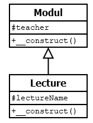
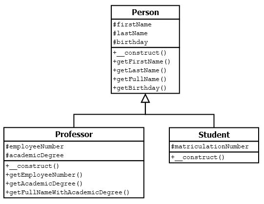

Beginnen wir nun zunächst sehr einfach. Wir können uns ein Beispiel überlegen, in dem wir zwei Klassen haben und mit beiden Klassen im Hauptprogramm arbeiten.

Stellen wir uns vor, dass Anna ein Studium als Tierärztin macht und reitet. Dann könnten wir die zwei bisher betrachteten Klassen **Student** und **Horse** nehmen.

Klasse Horse.php 
```php
<?php
class Horse
{
    private $horseType;
  
    public function __construct(string $horseType)
    {
        $this->horseType = $horseTyp;
    }

    public function ride(string $location): string
    {
        return "Ich habe ein {$this->horseType} 
              und reite {$location} <br>";
    }
}
```

Klasse Student.php 
```php
<?php
class Student
{
    private $name         = "keine Angabe";
    private $matrNumber   = 0;    
    private $phoneNumber  = "keine Angabe";

    public function __construct(string $name, int $matrNumber)
    {
        $this->matrNr = $matrNumber;
        $this->name   = $name;
    }

    public function getName(): string
    {
        return $this->name; 
    }

    public function getMatriculationNumber(): int
    {
        return $this->matrNumber; 
    }

    public function setPhoneNumber(string $newPhoneNumber): void
    {
        $this->phoneNumber = $newPhoneNumber;
    }
	
    public function getPhoneNumber(): string
    {
        return $this->phoneNumber;
    }
}
```


Nun können wir im Hauptprogramm eine Instanz der Klasse Horse und eine Instanz der Klasse Student bilden. 

```
// Hauptprogramm
$annaHorse  = new Horse("Deutsches Reitpony");
$annaStudent = new Student("Anna", "7205555"); 

...
```

Damit haben wir die beiden Objekte **$annaHorse** und **$annaStudent**. Und auf die Methoden der jeweiligen Objekte können wir unabhängig voneinander zugreifen.

Im Klassendiagramm sieht dies dann so aus, dass beide Klassen ohne eine Beziehung, also ohne eine Relation zueinander dargestellt werden.

[](https://isp.eduloop.de/mediawiki/images/isp.eduloop.de/1/1e/Relation-ohne.png)

# 1 UML-Diagramme verstehen (Vererbung, Komposition und Aggregation)

Es kann verschiedene Relationen zwischen Klassen geben. Im Folgenden schauen wir uns zunächst die Klassendiagramme an und dann, wie dies im Sourcecode aussieht.


--- 

**IST-EIN**
Wir unterscheiden die beiden Relationenstypen **"IST-EIN"** und **"HAT-EIN"**.
- **IST-EIN**: Bei der **Vererbung** haben wir eine Basisklasse, z.B. "Tier" und zwei Unterklassen z.B. "Hund" und "Katze". Somit können wir sagen:
    - Ein "Hund" **ist ein** "Tier".
    - Sowie eine "Katze" **ist ein** "Tier".


Im Klassendiagramm sieht dies wie folgt aus

[](https://isp.eduloop.de/mediawiki/images/isp.eduloop.de/8/81/Relation-VererbungEinfach.png)

**Der geschlossene Pfeil zeigt damit immer zur Basisklasse, so wie wir auch den Satz gebildet haben: "Hund" -> "Tier".** Eine Vererbung ist immer dann sinnvoll, wenn bestimmte Dinge auf die Unterklassen zutreffen, z.B. hören, sehen, laufen etc., die man aber zentral in einer Basisklasse definieren kann.


 **HAT-EIN**
- **HAT-EIN**: Bei der Relation HAT-EIN wird etwas aus einer anderen Klasse genutzt. Und wir können zwei Fälle unterscheiden, die im folgenden Beispiel klar werden.
    - Ein "Hund" **hat eine** Schnauze. Dies ist eine **Komposition** zweier Klassen. Von einer Komposition wird immer dann gesprochen, wenn ein Teil nicht ohne das genutzte Teil existieren kann. Da es keine Schnauze ohne einen Hund gibt, besteht eine **harte Abhängigkeit** zwischen diesen beiden Klassen.
    - Ein "Hund" **hat ein** Halsband. Dies ist eine **Aggregation** zweier Klassen. Von einer Aggregation wird immer dann gesprochen, wenn beide Teile unabhängig voneinander existieren können, also eine **weiche Abhängigkeit** zwischen diesen beiden Klassen besteht. Es gibt Hunde ohne Halsband und es gibt Halsbänder zu kaufen, die noch keinem Hund zugeordnet sind. Wenn aber Hund und Halsband vorhanden sind, dann lässt sich (in der Regel) eindeutig eine (Sprech-)Richtung angeben: ein "Hund" **hat ein** "Halsband".


Im Klassendiagramm gibt es nun die Besonderheit, dass in beiden Fällen die "Pfeile" genau umgekehr zur Sprechrichtung gezeichnet werden. Die Komposition wird mit einer ausgemalten Raute gekennzeichnet und die Aggregation mit einer nicht ausgemalten Raute.

[](https://isp.eduloop.de/mediawiki/images/isp.eduloop.de/1/12/Relation-KompositionAggregationEinfach.png)

Das Klasendiagramm zeigt noch etwas: Hebt man den Hund hoch, so hat man auch die Schnauze und das Halsband mit im Arm. An der Klasse, die man "hochhebt", sind immer die Rauten.


---


Die Begriffe "Komposition" und "Aggregation" werden zum Oberbegriff "Assoziation" zusammengefasst. 

Eine "Assoziation" wird mit einem einfachen Strich dargestellt und zeigt damit normalerweise keine (Sprech-)Richtung an.
[](https://isp.eduloop.de/mediawiki/images/isp.eduloop.de/a/a5/Relation-AssoziationenEinfach.png)


Nun können wir das oben Gelernte zu einem komplexeren Klassendiagramm zusammenfassen. Dabei beachten wir, dass nicht nur der Hund, sondern auch die Katze eine Schnauze hat und wir somit die Klasse "Schnauze" der Basisklasse "Tier" zuordnen können. Wir nehmen aber an, dass sich Katzen nicht mit Halsbändern wohlfühlen.

[](https://isp.eduloop.de/mediawiki/images/isp.eduloop.de/f/fb/Relation-VererbungAssoziationenEinfach.png)

 Abb. 68: Vererbung, Komposition und Aggregation

  
In den nächsten Unterkapiteln wird nun gezeigt, wie diese Relationen programmiert werden können. Wir beginnen bei der Vererbung, doch zuvor muss nun noch eine neue Art des Klassenaufrufs eingeführt werden: Der statische Aufruf von Klassen.


# 2 Statische Aufrufe von Klassen

Bisher waren Sie es gewohnt, Objekte zu erzeugen, bevor Methoden aus einer Klasse verwendet werden können. Hier wird nun beschrieben, **wie eine Klasse ohne die Erstellung von Objekten "statisch" genutzt werden kann**. Dabei unterscheiden wir zwischen statischen Eigenschaften und statischen Methoden.

Durch das Schlüsselwort **static** wird symbolisiert, dass es sich um eine statische Eigenschaft (siehe **Zeile 3**) oder eine statische Methode (siehe **Zeile 6**) handelt. Statisch bedeutet hierbei, dass etwas gleichbleibend ist. Wird diese Methode mehrmals innerhalb einer Klasse oder sogar innerhalb eines Programmes mit einer Vielzahl von Klassen benötigt, erleichtert die Nutzung von _static_ den schnellen wiederholten Aufruf.


```
class Hours {
    protected static $hours = 24;  // Statische Eigenschaft 
    // Statische Methode
    public static function getHoursPerDay(): int 
    {
        return self::$hours;
    }
}
```

In einer Klasse selbst werden statische Eigenschaften durch _**self::**_ aufgerufen (siehe **Zeile 8**), statt wie bisher durch `_$this->`_. Möchte man auf eine statische Eigenschaft außerhalb der aktuellen Klasse zugreifen, ersetzt man das `self` durch den Klassennamen, in dem sich die Ursprungsmethode befindet, in unserem Beispiel also _Hours::$hours_.

  
Wenn man auf Methoden aus einer Basisklasse (siehe [UML-Diagramme verstehen](https://isp.eduloop.de/loop/UML-Diagramme_verstehen "UML-Diagramme verstehen")) zugreifen möchte, dann bietet sich die Nutzung des Schlüsselwortes _**parent::**_ an. Hierbei handelt es sich um eine professionelle Verwendung eines statischen Aufrufs. Befindet man sich in einer Unterklasse, kann man Methoden der Basisklasse so einfach einbinden, ohne immer wieder den vollen Namen der Klasse ausschreiben zu müssen. Das folgende Beispiel stellt dies in vereinfachter Form dar.


```
class Minutes extends Hours {     // Wir befinden und in der Unterklasse

    public function __construct()
    {
        // Aufruf des Konstruktors der Basisklasse
        parent::__construct(int $hours);  
        ...
    }
}
```


Dadurch, dass man dank statischer Methoden kein Objekt deklarieren muss, können sie **global** verwendet werden. Doch die **Globalität** statischer Methoden und Eigenschaften gegenüber der Verwendung lokal gültiger (new) Objekte hat **große Nachteile**: (a) die **Übersichtlichkeit geht schneller verloren**, (b) eine **hohe Fehleranfälligkeit** beim späteren Verändern der Methoden und (c) die dauerhafte Bindung der Klassen bei statischen Aufrufen **nimmt die Möglichkeit die Funktionalität auszutauschen**. Dieses ist vor allem beim Testen ein großer Nachteil.

Wenn eine statische Methode später mal verändert wird, so bedeutet es, dass dies Auswirkungen auf jeden einzelnen Aufruf haben wird. Und dies ist sehr fehleranfällig. **Statische Methoden sollte man also dem Namen gleich unangerührt belassen, also nie ändern.**

# 3 Vererbung

PHP unterstützt nur die sogenannte Einfachvererbung. Damit kann nur von einer einzigen Klasse geerbt werden. Aber Klassen können beliebig oft vererbt werden. Erben erfolgt mit _extends_.

[](https://isp.eduloop.de/mediawiki/images/isp.eduloop.de/3/33/Einfachvererbung.png)


Das Wort "vererben" (= inheritance) beschreibt eigentlich gar nicht so gut, was passiert. Die in PHP (und Java) verwendete Bezeichnung "extends" (= erweitern) ist da viel besser, denn die Basisklasse wird durch eine Unterklasse um Eigenschaften und Methoden erweitert.

**Klasse B extends (= erweitert) Klasse A.**  

**In der Basisklasse A sind also einige Eigenschaften und Methoden vorhanden und die Unterklasse B erweitert nun die Eigenschaften und Methoden aus Klasse A um weitere Eigenschaften und Methoden.** Damit ist aus meiner Sicht die Sache viel klarer dargestellt als wenn man vom "erben" spricht.


Auf alle Methoden der Basisklasse A kann mit dem Schlüsselwort parent:: zugegriffen werden. Wie bereits behandelt, nutzen wir parent:: für den statischen Methodenaufruf.

In dem gezeigten Beispiel wird damit der Konstruktor der Basisklasse Modul aufgerufen, was bei PHP nicht automatisch geschieht. 


```php
<?php
class Modul                          // Basisklasse "Modul"
{
     protected $teacher;             // Eigenschaft der Basisklasse

     public function __construct()   // Konstruktor der Basisklasse
     {
         $this->teacher= "Thomaschewski";
     }
}

class Lecture extends Modul           // Unterklasse "Lecture" 
{
     protected $lectureName;          // Eigenschaft von "Lecture"

     public function __construct()    // Konstruktor von "Lecture"
     {
         $this->lectureName = "Vorlesung Internetprogrammierung";
         parent::__construct();
     }
}
```


Eine Vererbung wird im Klassendiagramm durch einen Pfeil "mit offenem Dreieck" gezeichnet. Für unser Beispiel sieht das Klassendiagramm wie folgt aus: 



Im Hauptprogramm wird dann (normalerweise) nur die Unterklasse verwendet, die aber durch die Vererbung alle Eigenschaften und Methoden der Basisklasse hat.


**Wichtige Programmieraufgabe zum Ermitteln des Wissenstandes**  

Im Beispiel sind die Strings "Thomaschewski" und "Vorlesung Internetprogrammierung" im Konstruktor fest vorgegeben. So etwas macht man natürlich nicht, sondern man übergibt die Daten aus dem Hauptprogramm. Hier kommt somit eine mehrstufige Aufgabe:  
  
1. Schreiben Sie ein Hauptprogramm zu den Klassen. Jede Klasse soll in eine eigene Datei. Somit gibt es dann also die Dateien _**Modul.php**_, _**Lecture.php**_ und das Hauptprogramm _**index.php**_. Natürlich wird so noch nichts ausgegeben, da die Klassen ja nur aus Konstruktoren bestehen. Schreiben Sie also zusätzlich in der Klasse _Lecture_ eine Getter-Methode _**getLecture()**_, die die Inhalte der Eigenschaft _$lectureName_ mittels _return_ an das Hauptprogramm in einem sinnvollen String übergibt. Im Hauptprogramm selbst müssen Sie drei Dinge machen

(a) mit _**require_once 'Modul.php';**_ und _**require_once 'Lecture.php';**_ die Klassen dem Hauptprogramm bekannt machen,

(b) eine Instanz von _Lecture_ bilden und

(c) im _echo_-Befehl die Getter-Methode aufrufen.  

2. Schreiben Sie nun eine weitere Getter-Methode _**getLectureWithTeacher()**_, die die Eigenschaften _$teacher_ und _$lectureName_ mittels _return_ an das Hauptprogramm übergibt. Im Hauptprogramm rufen Sie dann _getLectureWithTeacher()_ statt _getLecture()_ auf. Hinweis: Aufgrund der Vererbung können Sie einfach _**$this->teacher**_ verwenden, obwohl die Eigenschaft in der Basisklasse definiert ist.  
3. Schreiben Sie das Hauptprogramm und die Klasse _Lecture_ so um, dass der String "Vorlesung Internetprogrammierung" aus dem Hauptprogramm an den Konstruktor übergeben wird.  
4. Ersetzen Sie nun den festen Eintrag "Thomaschewski" in der Basisklasse, sodass dieser auch bei der Instanzierung übergeben wird.

## 3.1 weiteres Beispiel

Nun soll ein etwas komplexeres Beispiel gezeigt werden, in dem zwei Klassen von einer Basisklasse erben.




**Basisklasse Person**

```
<?php declare(strict_types=1);
class Person
{
    protected $firstName;
    protected $lastName;
    protected $birthday;
    public function __construct(
        string $firstName, 
        string $lastName, 
        DateTime $birthday
    ) {
        $this->firstName = $firstName;
        $this->lastName = $lastName;
        $this->birthday = $birthday;
    }
    public function getFirstName(): string
    {
        return $this->firstName;
    }
    public function getLastName(): string
    {
        return $this->lastName;
    }
    public function getFullName(): string
    {
        return $this->firstName.' '.$this->lastName;
    }
    public function getBirthday(): DateTime
    {
        return $this->birthday;
    }
}
```

**Klasse Professor**

```
<?php declare(strict_types=1);
class Professor extends Person
{
    protected $employeeNumber;
    protected $academicDegree;
    public function __construct(
        string $firstName,
        string $lastName,
        DateTime $birthday,
        int $employeeNumber,
        string $academicDegree
    ) {
        parent::__construct($firstName, $lastName, $birthday);
        $this->employeeNumber = $employeeNumber;
        $this->academicDegree = $academicDegree;
    }
    public function getEmployeeNumber(): int
    {
        return $this->employeeNumber;
    }
    public function getAcademicDegree(): string
    {
        return $this->academicDegree;
    }
    public function getFullNameWithAcademicDegree(): string
    {
        return $this->academicDegree
               .' '
               .$this->firstName
               .' '
               .$this->lastName;
    }
}
```
**Klasse Student**

```
<?php declare(strict_types=1);
class Student extends Person
{
    protected $matriculationNumber;
    public function __construct(
        string $firstName,
        string $lastName,
        DateTime $birthday,
        int $matriculationNumber
    ) {
        parent::__construct($firstName, $lastName, $birthday);
        $this->matriculationNumber = $matriculationNumber;
    }
}
```

Beachten Sie die Schreibweise bei den Konstruktoren. Dort wurden zur Übersichtlichkeit die Variablen untereinander geschrieben.

Und in der Klasse _Professor_ wurde in den **Zeilen 32-35** auch die return-Zeile übersichtlich untereinander geschrieben, jeweils mit dem "." beginnend. Der "." verkettet die einzelnen Strings zu einem Gesamtstring (siehe [Übersicht über Operatoren](https://isp.eduloop.de/loop/%C3%9Cbersicht_%C3%BCber_Operatoren "Übersicht über Operatoren")).


Verwenden lassen sich beide Klassen im folgenden Hauptprogramm.
Hauptprogramm 
```
<?php declare(strict_types=1);
require_once __DIR__.DIRECTORY_SEPARATOR.'Person.php';
require_once __DIR__.DIRECTORY_SEPARATOR.'Professor.php';
require_once __DIR__.DIRECTORY_SEPARATOR.'Student.php';

$student = new Student(
    'Hans',
    'Müller',
    new DateTime('1995-03-21'),
    12345678
);

$professor = new Professor(
    'Alberta',
    'Zweistein',
    new DateTime('1970-02-01'),
    42,
    'Prof. Dr.'
);


echo "Wir haben den 
     {$professor->getFullNameWithAcademicDegree()} <br>";
?>
```

Ausgabe:  
_Wir haben den Prof. Dr. Alberta Zweistein_

In den **Zeilen 6 & 16** wurde ein Objekt gebildet mit _new DateTime(...)_. Anstelle einer Variablen übergeben wir nun ein Objekt an die Methoden. Denn schließlich wird ein Objekt mit _new_ gebildet.


Der Aufruf des Konstruktors im Hauptprogramm erfolgt also mit

```
$professor = new Professor(
    'Alberta',
    'Zweistein',
    new DateTime('1970-02-01'),
    42,
    'Prof. Dr.'
);
```

Und der Konstruktur in der Klasse _Professor_ erwartet dieses Objekt mit

```
    public function __construct(
        string $firstName,
        string $lastName,
        DateTime $birthday,
        int $employeeNumber,
        string $academicDegree
    )
```

Während wir mit den Gettern _getEmployeeNumber()_, _getAcademicDegree()_ etc. einen String zurückbekommen und diesen direkt mit _echo_ ausgeben können, klappt dies bei _getBirthday()_ nicht, denn da bekommen wir ja ein Objekt zurück und dies lässt sich mit _echo_ nicht ausgeben. Wie wir das Geburtsdatum angezeigt bekommen, behandeln wir im Unterkapitel [Datum ausgeben mit DateTime](https://isp.eduloop.de/loop/Datum_ausgeben_mit_DateTime "Datum ausgeben mit DateTime").


Studierende möchte oft wissen, wie sie sich ein Objekt vorstellen können.

- Sie haben sich an den Begriff _Variable_ gewöhnt und wissen, dass eine Variable einen Wert enthält.
- Sie haben sich sogar an den Begriff _Array_ gewöhnt und wissen, dass in einem Array ganz viele Werte stecken können (entweder durchnummeriert als indiziertes Array oder jeweils mit einem Key versehen als assoziatives Array).
- Wenn Sie sich unter einem Objekt etwas vorstellen wollen, dass wäre es ein Karton, der verschiedene Dinge enthalten kann. In unserem Fall enthält dieser Karton jedoch nur einen String (im Datumsformat).


  
Hier können Sie eine Zip-Datei herunterladen, die den gesamten Sourcecode enthält. Sie sollten das Programm unbedingt **auf Ihrem Server installieren und ausprobieren**: [Vererbung3.zip](https://isp.eduloop.de/mediawiki/images/isp.eduloop.de/c/c3/Vererbung3.zip "Vererbung3.zip").

Hinweis: Der Sourcecode in den Dateien von Vererbung3.zip enthält (anders als der Sourcecode auf dieser Seite) sinnvolle Kommentare, so wie ein Sourcecode professionell aufgebaut werden sollte. Für Anfänger*innen sind die Kommentare oft störend, da der Sourcecode dann insgesamt so lang ist. Wenn die Kommentare stören, dann erstmal löschen, um das Programm zu verstehen. Und sobald Sie das Programm verstanden haben, sollten Sie die Kommentare ansehen und auch diese verstehen.


# 4 Aggregation und Komposition

In den bisherigen Beispielen haben wir die Vererbung (= **IST-EIN**) behandelt. Der "Professor" ist eine "Person" und der "Student" ist eine "Person".

Im Unterkapitel "[UML-Diagramme verstehen](https://isp.eduloop.de/loop/UML-Diagramme_verstehen "UML-Diagramme verstehen")" haben wir aber auch die Relation **HAT-EIN** eingeführt. Hier wollen wir den PHP-Code zu folgendem Beispiel zeigen:

[](https://isp.eduloop.de/mediawiki/images/isp.eduloop.de/d/d5/UML-KompositionProfessorCourse.png)

 Abb. 69: Jeder Course hat einen Professor (Komposition)

当你操作 ptofessor 的时候 会连带着一起操作 professor 
  
In der Programmierung können wir dies sehr einfach realisieren, in dem wir **in der Klasse Course eine Eigenschaft schreiben, in die später das Objekt der Klasse Professor gespeichert wird** (siehe **Zeile 5**).

Wir übergeben im Konstruktor (**Zeile 7**) dann das Objekt der **Klasse Professor**, das wir zuvor im Hauptprogramm erstellen müssen.


**Klasse Course**
```php
<?php declare(strict_types=1);
class Course
{
    protected $name;
    protected $professor;

    public function __construct(Professor $professor, string $name)
    {
        $this->professor = $professor;
        $this->name = $name;
    }

    public function getName(): string
    {
        return $this->name;
    }

    public function getProfessor(): Professor
    {
        return $this->professor;
    }
}
```

Bildlich gesprochen stellen wir uns eine Klasse ja als "Behälter" vor, in der Eigenschaften und Methoden vorhanden sind (siehe [Warum Objektorientierung](https://isp.eduloop.de/loop/Warum_Objektorientierung "Warum Objektorientierung")). Und damit füllen wir einen Behälter einfach in einen anderen Behälter ein, so wie man einen Karton in einem anderen Karton verpacken kann. Damit enthält der "Karton" _Course_ nun den "Karton" _Professor_.

Die Eigenschaft _$name_ ist der Name des Kurses, also z.B. "Internet-Progammierung".

Das zugehörige Hauptprogramm sieht dann so aus, dass wir zunächst die Klasse _Professor_ instanzieren (**Zeile 10**) und dann die Klasse _Course_ (**Zeile 22**).


Hauptprogramm 
```php
<?php declare(strict_types=1);

require_once 'Course.php';
require_once 'Person.php';    
require_once 'Professor.php';

/*
* Klasse Professor instanzieren - also ein Objekt $professor erstellen
*/
$professor = new Professor(
    string 'Jörg',
    string 'Thomaschewski',
    new DateTime('1970-02-01'),
    int 42,
    string 'Prof. Dr.'
);

/*
* Klasse Course instanzieren - also ein Objekt $course erstellen.
* Klasse 'Course' erhält das zuvor erstellte Objekt $professor.
*/
$course = new Course(
    $professor,
    'Internet-Programmierung'
);

echo "Die Lehrveranstaltung ist '{$course->getName()}'";

echo "Veranstaltung von {$course->getProfessor()->getLastName()} <br>";

echo "Veranstaltung von {$professor->getLastName()} <br>";

```


Ausgabe auf dem Browser

[](https://isp.eduloop.de/mediawiki/images/isp.eduloop.de/2/2d/UML-KompositionProfessorCourse-Beispiel1.png)

Der wichtige Punkt ist also, dass wir zunächst die Klasse _Professor_ instanziert haben und ein Objekt `_$professor`_ erstellt haben. Anschließend haben wir die Klasse _Course_ instanziert und im Konstruktor das Objekt `_$professor`_ übergeben. Wir haben also ein Objekt _`$course`_, dass das Objekt _`$professor`_ enthält.

- **Zeile 27**: Hier wird auf die Methode _**getName()**_ der Klasse Course bzw. besser ausgedrückt des **Objektes` $course`** zugegriffen und der Name der Lehrveranstaltung ausgelesen. Bei _`getName()`_ handelt es sich ja um einen Getter, der die entsprechende Eigenschaft _$name_ (Klasse Course, Zeilen 13-16 bzw. Zeile 4) ausliest und einen String zurückliefert.


**Bevor Sie jetzt weiterlesen, sollte es Ihnen wirklich klar sein, was hier passiert, denn ansonsten können Sie den nächsten Punkt nicht verstehen!**

**Zeile 29**: Hier haben wir etwas Neues! Wir greifen auf die Methode _**getProfessor()**_ des **Objektes `$course`** zu. Hierbei handelt es sich wiederum um einen Getter, aber diesmal wird kein String, sondern das komplette Objekt `_$professor`_ zurückgegeben. _**`$course->getProfessor()`**_ enthält also das Objekt _**$professor**_, auf das wir den Getter _**getLastName()**_ anwenden, um den Nachnamen des Professors als String zu bekommen.


Zum besseren Verständnis des Ganzen: Sie haben ein Paket mit vielen verschiedenen Süßigkeiten bekommen. Und die Süßigkeiten sind natürlich auch wieder in Päckchen verpackt. Obendrauf liegt eine Karte mit dem String "Viele Grüße". Wenn Sie jetzt einen "Getter" auf die Karte anwenden, dann erhalten Sie als Ergebnis den String "Viele Grüße". Wenn Sie aber einen Getter auf ein Süßigkeiten-Päckchen anwenden, dann entnehmen Sie das ganze Päckchen, können es öffenen und eine Süßigkeit naschen.

**Zeile 31**: Im Ergebnis kommt dasselbe raus, wie bei Zeile 29. Der Getter _**getLastName()**_ des **Objektes $professor** wird aufgerufen.


Warum ein Aufruf wie in **Zeile 29** Sinn machen kann, zeigen wir später an einem anderen Beispiel. Hier begnügen wir uns damit, dass es so funktioniert. Nun sollten Sie das Programm auf Ihrem Server installieren: [Komposition.zip](https://isp.eduloop.de/mediawiki/images/isp.eduloop.de/a/a0/Komposition.zip "Komposition.zip").

Wir haben ein Beispiel für die Komposition erstellt. Damit sagen wir, dass ein _Course_ immer einen _Professor_ haben muss. Aber in der Programmierung macht es (zunächst) keinen Unterschied, ob es eine Komposition oder eine Aggregation ist. Beides wird gleich erstellt. Beides bedeutet "ein Course **hat einen** Professor".


## 4.1 Beispiel mit Vererbung, Aggregation und Komposition

Nun wird es noch etwas komplexer, denn wir nehmen noch eine Klasse hinzu. Das gesamte Klassendiagramm sieht nun wie folgt aus:

[](https://isp.eduloop.de/mediawiki/images/isp.eduloop.de/7/70/UML-BeispielThorsten.png)


person.php
```php
<?php declare(strict_types=1);

class Person
{
    protected $firstName;
    protected $lastName;
    protected $birthday;

    public function __construct(
        string $firstName,
        string $lastName,
        DateTime $birthday
    ) {
        $this->firstName = $firstName;
        $this->lastName = $lastName;
        $this->birthday = $birthday;
    }

    public function getFirstName(): string
    {
        return $this->firstName;
    }

    public function getLastName(): string
    {
        return $this->lastName;
    }

    public function getFullName(): string
    {
        return $this->firstName.' '.$this->lastName;
    }

    public function getBirthday(): DateTime
    {
        return $this->birthday;
    }
}
```


professor.php 
```
<?php declare(strict_types=1);
class Professor extends Person
{
    protected $employeeNumber;
    protected $academicDegree;
    public function __construct(
        string $firstName,
        string $lastName,
        DateTime $birthday,
        int $employeeNumber,
        string $academicDegree
    ) {
        parent::__construct($firstName, $lastName, $birthday);
        $this->employeeNumber = $employeeNumber;
        $this->academicDegree = $academicDegree;
    }
    public function getEmployeeNumber(): int
    {
        return $this->employeeNumber;
    }
    public function getAcademicDegree(): string
    {
        return $this->academicDegree;
    }
    public function getFullNameWithAcademicDegree(): string
    {
        return $this->academicDegree.' '.$this->firstName.' '.$this->lastName;
    }
}
```


student.php 
```
<?php declare(strict_types=1);

class Student extends Person
{
    protected $matriculationNumber;

    public function __construct(
        string $firstName,
        string $lastName,
        DateTime $birthday,
        int $matriculationNumber
    ) {
        parent::__construct($firstName, $lastName, $birthday);
        $this->matriculationNumber = $matriculationNumber;
    }

     public function getLearningForCourseSentence(Course $course): string
    {
        return "{$this->getFullName()} is learning "
            ."for course {$course->getName()} "
            ."taught by {$course->getProfessor()->getFullNameWithAcademicDegree()}.";
    }
}

```


course.php 
```
<?php declare(strict_types=1);

class Course
{
    protected $name;
    protected $professor;

    public function __construct(Professor $professor, string $name)
    {
        $this->professor = $professor;
        $this->name = $name;
    }

    public function getName(): string
    {
        return $this->name;
    }

     public function getProfessor(): Professor
    {
        return $this->professor;
    }
}
```


ofiice.php 
```
<?php declare(strict_types=1);
class Office
{
    protected $professor;
    protected $roomNumber;
    protected $openingHour;
    protected $closingHour;
    public function __construct(
        Professor $professor,
        int $roomNumber,
        int $openingHour,
        int $closingHour
    ) {
        $this->professor = $professor;
        $this->roomNumber = $roomNumber;
        $this->openingHour = $openingHour;
        $this->closingHour = $closingHour;
    }
     public function getProfessor(): Professor
    {
        return $this->professor;
    }
      public function getRoomNumber(): int
    {
        return $this->roomNumber;
    }
     public function isOpenAtHour(int $hour): bool
    {
        return $this->openingHour < $hour && $hour < $this->closingHour;
    }
    public function getStudentVisitSentence(Student $student, int $hour): string
    {
        $visitSentence = $student->getFullName()
            .' is attempting to visit '
            .$this->professor->getFullNameWithAcademicDegree()
            .' in room '
            .$this->roomNumber
            .' at '
            .$hour
            ." o'clock, ";
        if ($this->isOpenAtHour($hour)) {
            $visitSentence .= 'and '.$this->professor->getFullNameWithAcademicDegree().' is available.';
        } else {
            $visitSentence .= 'but '.$this->professor->getFullNameWithAcademicDegree().' is not available';
        }
        return $visitSentence;
    }
}
```


Hauptorgramm 
```
<?php declare(strict_types=1);
require_once __DIR__.DIRECTORY_SEPARATOR.'Course.php';
require_once __DIR__.DIRECTORY_SEPARATOR.'Office.php';
require_once __DIR__.DIRECTORY_SEPARATOR.'Person.php';
require_once __DIR__.DIRECTORY_SEPARATOR.'Professor.php';
require_once __DIR__.DIRECTORY_SEPARATOR.'Student.php';
$student = new Student(
    'Hans',
    'Müller',
    new DateTime('1995-03-21'),
    12345678
);
$professor = new Professor(
    'Alberta',
    'Zweistein',
    new DateTime('1970-02-01'),
    42,
    'Prof. Dr.'
);
$course = new Course($professor, 'Advanced Physics');
$office = new Office($professor, 5, 14, 18);
echo $student->getLearningForCourseSentence($course)."<br>".PHP_EOL;
print $office->getStudentVisitSentence($student, 12)."<br>".PHP_EOL;
print $office->getStudentVisitSentence($student, 15)."<br>".PHP_EOL;
```


Nun sollten Sie das Programm auf Ihrem Server installieren und ausprobieren. Und Sie sollten alle Dateien mit einem professionellen Editor öffnen, da die Übersichtlichkeit im Editor besser ist, als hier im Modul: [GesamtbeispielKlassenRelationen.zip](https://isp.eduloop.de/mediawiki/images/isp.eduloop.de/b/b8/GesamtbeispielKlassenRelationen.zip "GesamtbeispielKlassenRelationen.zip").

  
**Was ist neu?**  
Die Vererbung haben wir bereits behandelt und auch die Komposition zwischen den Klassen _Course_ und _Professor_. Die Aggregation zwischen den Klassen _Office_ und _Professor_ funktioniert genauso und ist damit auch nicht neu. Aber in der Klasse _**Office**_ ist eine interessante Methode, die wir uns hier genauer ansehen.

Code

**Ausschnitt aus der Klasse Office**

```
    public function getStudentVisitSentence(
        Student $student, 
        int $hour
    ): string {
        $visitSentence = $student->getFullName()
            .' is attempting to visit '
            .$this->professor->getFullNameWithAcademicDegree()
            .' in room '
            .$this->roomNumber
            .' at '
            .$hour
            ." o'clock, ";
        if ($this->isOpenAtHour($hour)) {
            $visitSentence .= 'and '
            .$this->professor->getFullNameWithAcademicDegree()
            .' is available.';
        } else {
            $visitSentence .= 'but '
            .$this->professor->getFullNameWithAcademicDegree()
            .' is not available';
        }
        return $visitSentence;
    }
```

- In **Zeile 2** wird das Objekt _$student_ der Klasse _Student_ an eine Methode übergeben. Damit ist es möglich, dass in **Zeile 5** mit dem Methodenaufruf _**$student->getFullName()**_ der Name des Studierenden ausgelesen werden kann. Wir lernen also, dass Objekte in einem Methodenaufruf genauso übergeben werden können, wie Variablen.

- Die **Zeilen 5-12** gehören zusammen und bilden einen langen String. Der "."-Operator verkettet (="verklebt") die Einzelteile zu einem Gesamtstring. Ebenso die **Zeilen 15-17** und die **Zeilen 19-21**. Die Schreibweise ist sicherlich gewöhnungsbedürftig. Aber wenn man sich daran gewöhnt hat, dann ist sie wirklich übersichtlich.

# 5 Abstrakte Klassen und Interfaces (=Schnittstellen)

Es gibt noch eine Besonderheit der Vererbung. Denn Vererbung kann auch dafür eingesetzt werden, **dass in einer Basisklasse nur definiert wird, was dann später in einer Unterklasse implementiert werden muss**.

Beispiel

Stellen Sie sich vor, dass Sie ein Team mit vielen Programmierer*innen leiten. Sie können dann in einer Basisklasse die Eigenschaften und Methoden vorgeben, die das Team nutzen muss. Machen wir das Bespiel mal konkreter: Es soll eine Software zur einheitlichen Verwaltung von Schülerinnen und Schülern in unterschiedlichsten Schulen erstellt werden und Sie geben vor, welche Eigenschaften (z.B. Vorname, Nachname, Geb.-Datum, etc) und welche Methoden als Basis in allen Schulen vorhanden sein sollen, damit die Datenbank des Ministeriums wirklich konsistent aufgebaut werden kann.

  
## 5.1 **Abstrakte Klassen**  
Eine abstrakte Klasse ist eine nicht instanzierbare Klasse. Also wird eine abstrakte Klasse nie direkt verwendet, sondern immer als Basisklasse eingesetzt. Sie vererbt ihre **(Grund-)Eigenschaften** und ihre **Methodendefinitionen**.

Ein typisches Beispiel für eine abstrakte Klasse ist eine Datenbankklasse die für verschiedene Datenbanksoftwaretypen eine Anbindung vereinheitlichen soll. Man hat also eine abstrakte Klasse, in der die Grundeigenschaften und Methodendefinitionen stehen. Für jedes konkrete Datenbanksystem (MySQL, Oracle, MicrosoftDB, etc.) gibt es dann eine entsprechende Unterklasse, die zunächst einmal die Eigenschaften und Methoden der abstraken Basisklasse implementieren muss und dann darüber hinaus noch weitere spezifische Eigenschaften und Methoden des konkreten Datenbanksystems haben kann.

Abstrakte Eigenschaften und Methoden werden mit dem Begriff _**abstract**_ gekennzeichnet. Abstrakte Methoden (z.B. **Zeile 14 + 15**) haben keine geschweiften Klammern, in denen "etwas gemacht" wird. Wir sprechen davon, dass abstrakte Klassen keinen Methodenkörper haben.


**Abstrakte Basisklasse**

```php
<?php declare(strict_types=1);
abstract class Db
{
    protected $connection = null;
    abstract public function connect(
        string $host = null,
        string $db = null,
        string $user = null,
        string $password = null,
        int $port = null
    );
    abstract public function query(string $query);
    abstract public function close();
    protected function escapeString(string $string): string 
    {
        return addslashes($string);
    }
}
```

**Unterklasse**  
Für das konkrete Datenbanksystem MySQL

```php
<?php declare(strict_types=1);
class DbMysql extends Db
{
    public function connect(
        string $host = null,
        string $db = null,
        string $user = null,
        string $password = null,
        int $port = null
    ) {
        $this->connection = mysqli_connect(
            $host.(!empty($port) ? ":{$port}" : "")
            , $user
            , $password
        );
        if (!empty($db)){
            mysqli_select_db($db);
        }
    }
    public function query(string $query): string
    {
        return mysql_send_query($this->escapeString($query));
    }
    public function close(): bool
    {
        return mysqli_close();
    }
    public function escapeString(string $string): string
    {
        return mysql_real_escape_string($string);
    }
}
```


Wir haben nun in der Unterklasse alle Methoden der abstrakten Basisklasse erneut verwendet und ein Verhalten implementiert, also geschweifte Klammern verwendet und einem Methodenkörper erstellt.

Eine abstrakte Klasse muss aber nicht ausschließlich abstrakte Eigenschaften und abstrakte Methoden enthalten. In der Basisklasse gibt es eine Methode (**Zeile 17**, die nicht als _abstract_ gekennzeichnet ist und einen Methodenkörper enthält (also etwas, was in geschweiften Klammern steht und "etwas macht").

  
## 5.2 **Interfaces (=Schnittstellen)**  
Interfaces, sind noch "abstrakter". Interfaces dürfen keine Eigenschaften besitzen und alle Methoden müssen abstract sein, wobei das Schlüsselwort _abstract_ entfällt, weil sie sowieso abstract sein müssen. Wir schreiben das Beispiel von oben mal als Interface.

**Interface**

```
<?php declare(strict_types=1);
Interface Db
{
    public function connect(
        string $host = null,
        string $db = null,
        string $user = null,
        string $password = null,
        int $port = null
    );
    public function query(string $query);
    public function close();
    public function escapeString(string $string); 
}
```

Folgende Dinge sind nun anders:
- Das Schlüsselwort ist nicht mehr _class_ sondern _**interface**_.
- Es darf keine Eigenschaften im Interface geben.
- Die Sichtbarkeit aller Methoden muss _**public**_ sein.
- Das _abstract_ entfällt, da ja sowieso alle Methoden "abstrakt" sind.


**Unterklasse**  
Mit _**implements**_ statt extends arbeiten. Ansonsten bleibt alles gleich.

```
<?php declare(strict_types=1);
class DbMysql implements Db
...
```

Das zugehörige UML-Diagramm:  
[](https://isp.eduloop.de/mediawiki/images/isp.eduloop.de/5/56/Interface1.png)

  
**Mehrfachvererbung bei "Interface"**  
Ein Interface kann also als vollständig abstrakte Klasse betrachtet werden. Aber es gibt noch eine Besonderheit für ein Interface. Von einer "normalen" Basisklasse dürfen zwar beliebig viele andere Klassen erben (es kann also viele Unterklassen geben), aber es gibt keine Mehrfachvererbung. Somit sind "Unter-Unterklassen" nicht möglich. Beim Interface ist Mehrfachvererbung erlaubt. Hier ein Beispiel.


**Interface Person**

```
interface Person
{
    public function getName();
}
```

**Interface Member**

```
interface Member
{
    public function getId();
}
```

**Interface CooperativeMember** erbt von **Person und Member**

```
interface CooperativeMember extends Person, Member
{
    public function getSalary();
}
```

**Klasse Employee implementiert CooperativeMember**

```
class Employee implements CooperativeMember 
{
    public function getName()
    {
        ...
    }
    public function getId()
    {
        ...
    }
    public function getSalary()
    {
        ...
    }
}
```


Das zugehörige UML-Diagramm:  
[](https://isp.eduloop.de/mediawiki/images/isp.eduloop.de/a/a4/Interface2.png)

